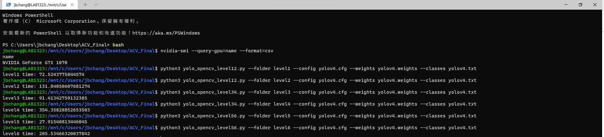

# ACV_Final_Project

## Environment
OS: Ubuntu 20.04
CPU: Intel i9-11900F
GPU: Nvidia GeForce RTX 3060
Editor: Visual Studio Code

**Note:** The computatoinal time depends on different hardwares

## Dependencies
* Python 3.8.10
* Yolov4
* opencv 4.5.5
* tensorflow 2.7.0

`pip install opencv-python tensorflow`

## Yolov4 Setup
Download the pre-trained YOLO v4 weights file from this link and place it in the current directory or you can directly download to the current directory in terminal using
```
$ wget https://github.com/AlexeyAB/darknet/releases/download/darknet_yolo_v3_optimal/yolov4.weights
```


## Level1 & Level2
**Command Format:** 
`python3 yolo_opencv_level12.py --folder [LEVEL_NAME] --config [PATH_TO_CONFIG] --weights [PATH_TO_WEIGHTS] --classes [PATH_TO_CLASSES]`

### Level1 

Run the followig command, you will get **level1_track** directory with the tracking result and **level1_result.txt** with all the bounding box information. 
**Command:**
```
$ python3 yolo_opencv_level12.py --folder level1 --config yolov4.cfg --weights yolov4.weights --classes yolov4.txt
```

### Level2

Run the followig command, you will get **level2_track** directory with the tracking result and **level2_result.txt** with all the bounding box information. 
**Command:**
```
$ python3 yolo_opencv_level12.py --folder level2 --config yolov4.cfg --weights yolov4.weights --classes yolov4.txt
```

## Level3 & Level4
**Command Format:** 
`python3 yolo_opencv_level34.py --folder [LEVEL_NAME] --config [PATH_TO_CONFIG] --weights [PATH_TO_WEIGHTS] --classes [PATH_TO_CLASSES]`

### Level3

Run the followig command, you will get **level3_track** directory with the tracking result and **level3_result.txt** with all the bounding box information. 
**Command:**
```
$ python3 yolo_opencv_level34.py --folder level3 --config yolov4.cfg --weights yolov4.weights --classes yolov4.txt
```

### Level4

Run the followig command, you will get **level4_track** directory with the tracking result and **level4_result.txt** with all the bounding box information. 
**Command:**
```
$ python3 yolo_opencv_level34.py --folder level4 --config yolov4.cfg --weights yolov4.weights --classes yolov4.txt
```

## Level5 & Level6
**Command Format:** 
`python3 yolo_opencv_level56.py --folder [LEVEL_NAME] --config [PATH_TO_CONFIG] --weights [PATH_TO_WEIGHTS] --classes [PATH_TO_CLASSES]`

### Level5

Run the followig command, you will get **level5_track** directory with the tracking result and **level5_result.txt** with all the bounding box information. 
**Command:**
```
$ python3 yolo_opencv_level56.py --folder level5 --config yolov4.cfg --weights yolov4.weights --classes yolov4.txt
```

### Level6

Run the followig command, you will get **level6_track** directory with the tracking result and **level6_result.txt** with all the bounding box information. 
**Command:**
```
$ python3 yolo_opencv_level56.py --folder level6 --config yolov4.cfg --weights yolov4.weights --classes yolov4.txt
```

## Output Result Video
Run the the following command to generate the result video with **VideoWriter**
`$ python3 generate_video.py --folder [LEVEL_NAME]`

## IoU Evaluation
Runing the following command to compare **detected bounding box text file** and **ground truth text file**.
**Command:**
`$ python3 result_iou.py --folder [LEVEL_NAME]`

### Level1

[level1 result video](https://drive.google.com/file/d/126GOoOJGd5_yHWTFSTvYLlLbiQOE9hwe/view?usp=sharing)

### Level2

[level2 result video](https://drive.google.com/file/d/1kt2BnRigdg-q7O_D-Ca2_fVk7F-ewunE/view?usp=sharing)

### Level3

[level3 result video](https://drive.google.com/file/d/16FiyYYx3Bb_UF-l7p24Ng02dtW6XYD9P/view?usp=sharing)

### Level4

[level4 result video](https://drive.google.com/file/d/1rxn5KHgcN0MZhv8zOOhTsv20k2HlPxS-/view?usp=sharing)

### Level5

[level5 result video](https://drive.google.com/file/d/1rxn5KHgcN0MZhv8zOOhTsv20k2HlPxS-/view?usp=sharing)

### Level6

[level6 result video](https://drive.google.com/file/d/1Q4gZAHulHNfoJi7gDZ4h-ZAaE1_UqHIs/view?usp=sharing)

## Time Evaluation RTX 3060


## Time Evaluation GTX 1070
